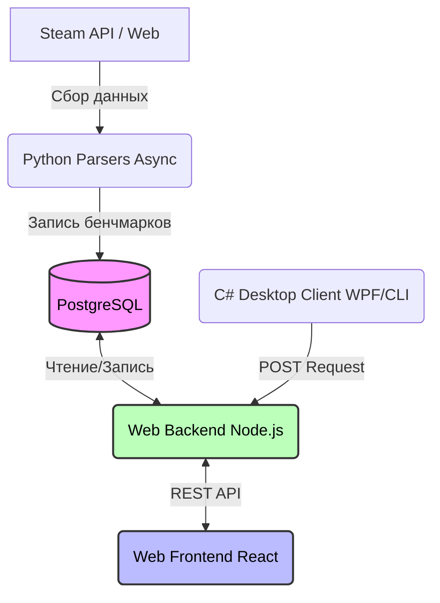

# Game Compatibility Checker (Software & Hardware Suite)

Выпускная квалификационная работа (ВКР). Распределенный программно-аппаратный комплекс для автоматического аудита системных характеристик ПК и анализа их совместимости с техническими требованиями компьютерных игр.

Проект объединяет веб-экосистему (Fullstack React + Node.js), десктопные утилиты для низкоуровневого анализа ОС Windows (C#) и асинхронный конвейер сбора данных (Python).

---

## 🏗 Архитектура

Система состоит из четырех независимых модулей, взаимодействующих через единую базу данных и REST API:



1. **Пайплайн данных (Python):** Асинхронно собирает информацию об играх и системных требованиях со **Steam**, а также агрегирует таблицы относительной производительности CPU и GPU из открытых бенчмарк-ресурсов.
2. **База данных (PostgreSQL):** Хранит нормализованные данные об играх, эталонные таблицы мощностей железа и пользовательские конфигурации.
3. **Клиентский софт (C#):** Собирает технические параметры ПК пользователя «в один клик» и отправляет их на бэкенд.
4. **Веб-интерфейс (React + Node.js):** Отображает каталог игр, вычисляет совместимость на основе математического сопоставления баллов производительности и визуализирует «узкие места» сборки пользователя.

---

## 🛠 Технологический стек

* **Web Frontend:** React.js, JavaScript (ES6+), Vite, Tailwind CSS, ESLint.
* **Web Backend:** Node.js, Express.js, pg-pool / Sequelize (PostgreSQL Driver).
* **Desktop Clients:** C# (.NET Core / .NET Framework), WPF (Windows Presentation Foundation) для GUI-версии, Консольный интерфейс (CLI).
* **Data Scraping:** Python 3, Asyncio, Aiohttp (асинлекс), BeautifulSoup4 / Playwright.
* **Database:** PostgreSQL (реляционная БД с оптимизированными индексами для поиска по тексту).

---

## ⚙️ Разбор модулей

### 🖥 1. Десктопные приложения (C# / WPF & CLI)
Разработаны в двух вариациях для обеспечения гибкости. Предназначены для безопасного низкоуровневого аудита железа без необходимости ручного ввода спецификаций пользователем.
* **Механизм сбора:** Через системные интерфейсы **WMI (Windows Management Instrumentation)** извлекаются точные модели CPU, GPU, объем оперативной памяти (RAM) и доступный объем на накопителях (HDD/SSD).
* **Интеграция (Сценарий "Б"):** Программа автоматически упаковывает собранные системные метрики в JSON-объект и отправляет прямой асинхронный `POST-запрос` к API веб-приложения, мгновенно привязывая конфигурацию железа к сессии пользователя.

### 🐍 2. Модуль сбора данных (Python Парсеры)
Включает 3 специализированных скрипта для наполнения базы знаний проекта.
* **Асинхронность (`asyncio`, `aiohttp`):** Ключевой парсер спроектирован под высокие сетевые нагрузки для обхода ограничений на количество запросов (Rate Limiting). Он одновременно обрабатывает сотни страниц каталога игр Steam.
* **Алгоритм маппинга:** Собранные текстовые названия видеокарт и процессоров парсер сопоставляет с числовыми индексами производительности (бенчмарками) и первично сохраняет эти связи в PostgreSQL для минимизации оверхеда на стороне Node.js.

### 🧮 3. Алгоритм сравнения производительности (Node.js)
Вместо неточного текстового сравнения строк ("*Intel Core i5*" vs "*i7*"), в проекте реализован **математический алгоритм вычисления совместимости**:
* Локальные файлы (включая `cpu_benchmarks.csv`) и таблицы БД преобразуют текстовые названия комплектующих в нормированные **баллы производительности** (Score).
* При запросе пользователя бэкенд сравнивает `Score` текущего ПК со значениями `Минимальных` и `Рекомендованных` требований игры, выдавая точный вердикт по каждому компоненту (CPU, GPU, RAM) отдельно.

---

## 📂 Структура репозитория

```env
├── backend/               # Серверное приложение на Node.js (REST API)
├── frontend/              # Клиентская часть веб-ресурса на React (Vite)
├── public/ & src/         # Компоненты, ассеты и глобальные стили фронтенда
├── desktop_csharp/        # [Логическая папка] Исходный код WPF и CLI утилит на C#
├── parsers_python/        # [Логическая папка] Асинхронные скрипты сбора данных
├── cpu_benchmarks.csv     # Таблица маппинга производительности процессоров
└── README.md              # Документация проекта
```
*(Примечание: Исходные файлы C# и Python модулей распределены по структуре репозитория согласно архитектурной логике проекта)*.

---

## 🚀 Инструкция по развертыванию и запуску

### 1. База данных
1. Разверните сервер **PostgreSQL**.
2. Создайте базу данных (схема таблиц находится в дампах проекта).
3. Настройте конфигурацию подключения в бэкенде.

### 2. Запуск Backend (Node.js)
```bash
cd backend
npm install
npm start
```
Сервер запустится на порту по умолчанию (например, `http://localhost:5000`).

### 3. Запуск Frontend (React)
```bash
cd frontend
npm install
npm run dev
```
Откройте локальный адрес, выданный сборщиком Vite (обычно `http://localhost:5173`).

### 4. Использование C# утилиты
* Скомпилируйте проект в Visual Studio или через .NET CLI.
* Запустите `WPF` приложение для графического интерфейса или используйте `CLI` версию для автоматизированного скриптинга в терминале. Убедитесь, что веб-сервер бэкенда запущен для успешного приема POST-запроса.
